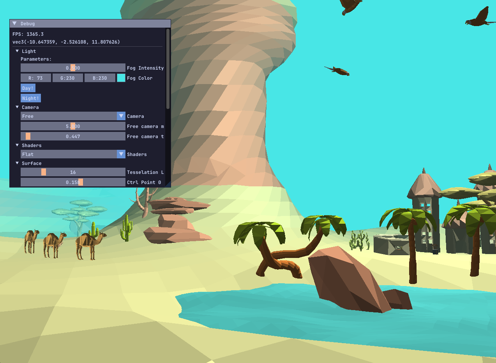
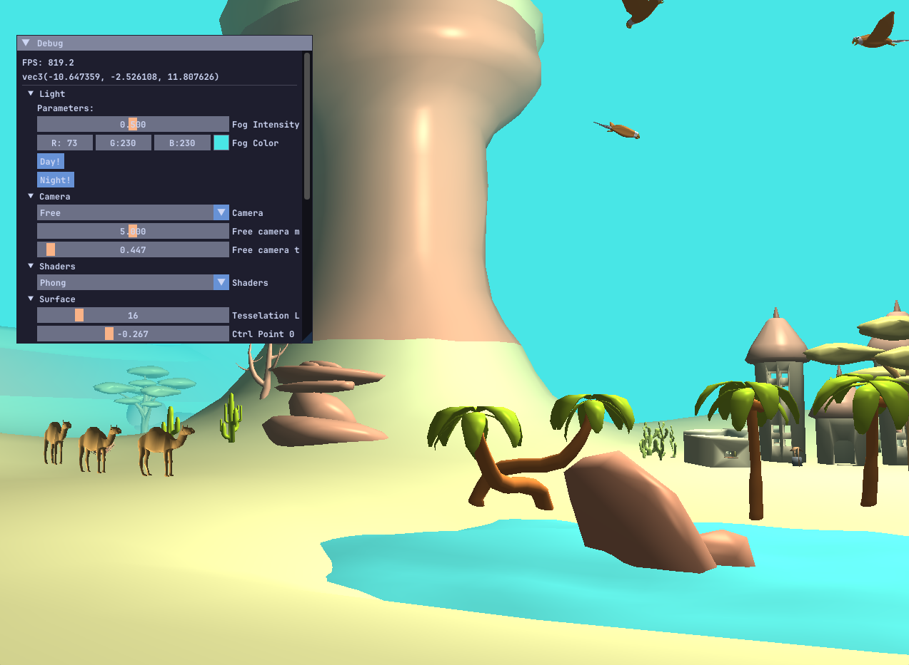
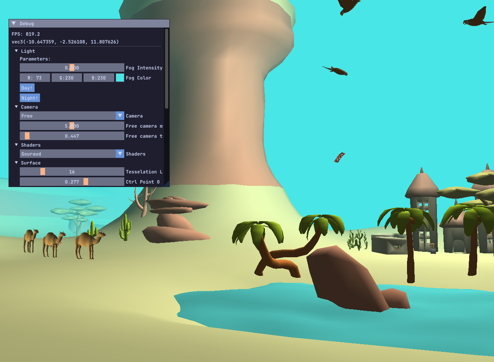

# 3D Desert Scene
An OpenGL scene renderer featuring different shaders, lights, model loading, tesselation and Bezier interpolation.

# Features
## Animated Bezier Surface (flying carpet)

## Shaders
Types of shaders implemented:
- Flat

- Phong

- Gouraud

## Cameras
App implements three types of cameras:
- Free camera controlled by WSAD and ↑ ↓ ← →.
- Camera fixed in place
- Camera tracking the flying object
- Third person camera stuck to the flyin object 
## Fog
Fog that can change it's intensity and color:

## Additional features
- Day and night implementation
- Carpet is emmiting point light
# Attributions
Project was made thanks to the tutorials by **[The Cherno](https://www.youtube.com/@TheCherno)** and **[LearnOpenGL](https://learnopengl.com/)**.  
3D model of the desert was made by **EdwiixGG** and can be found [here](https://sketchfab.com/3d-models/low-poly-desert-c25524a942704f5c833ac53b645cda82).